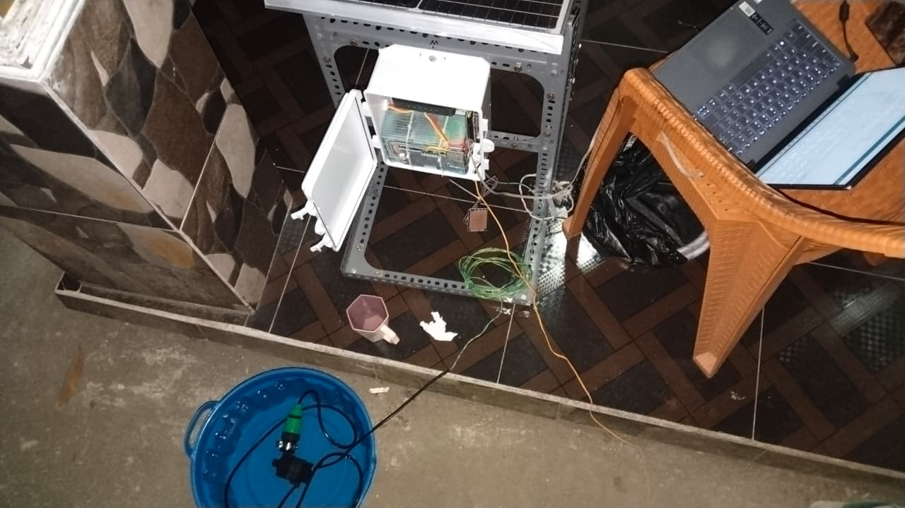
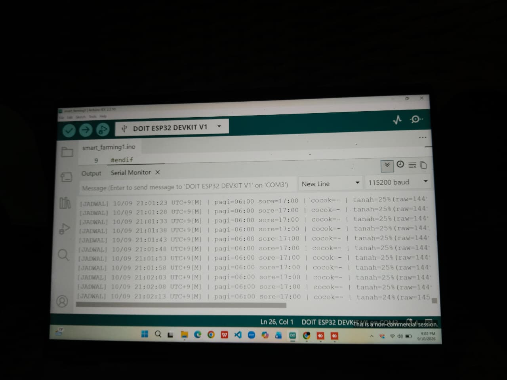
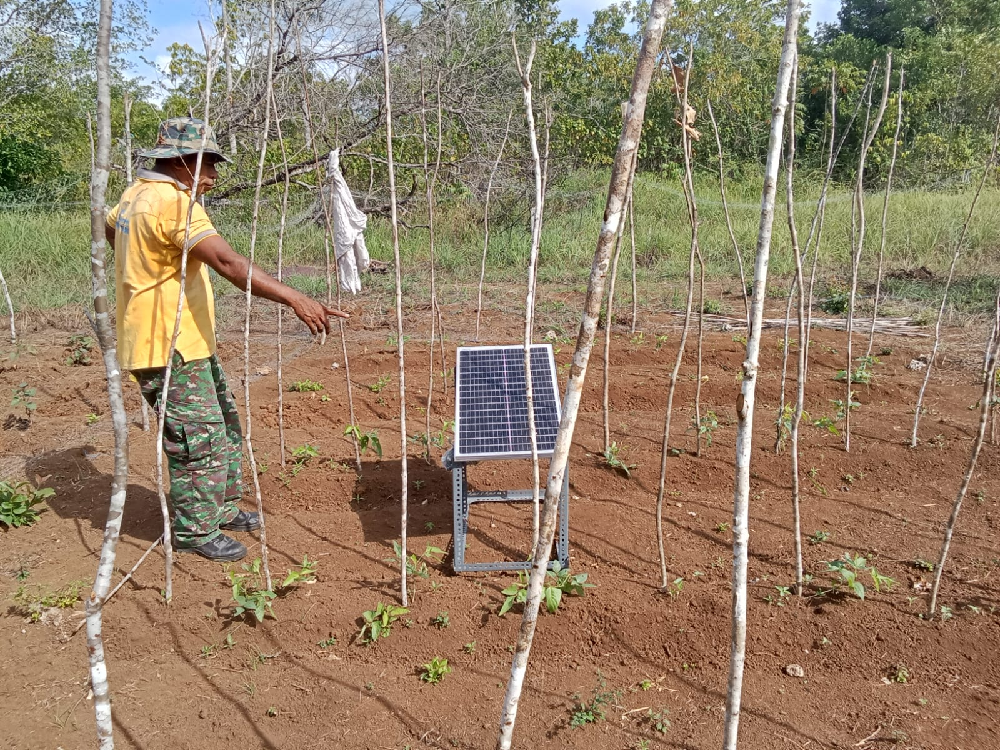
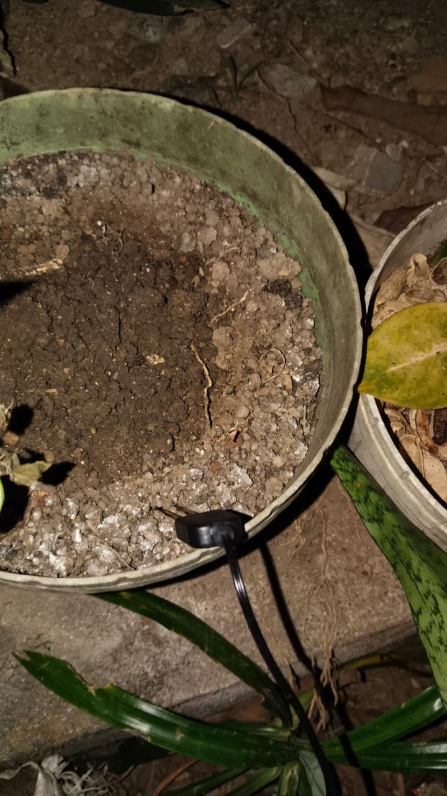
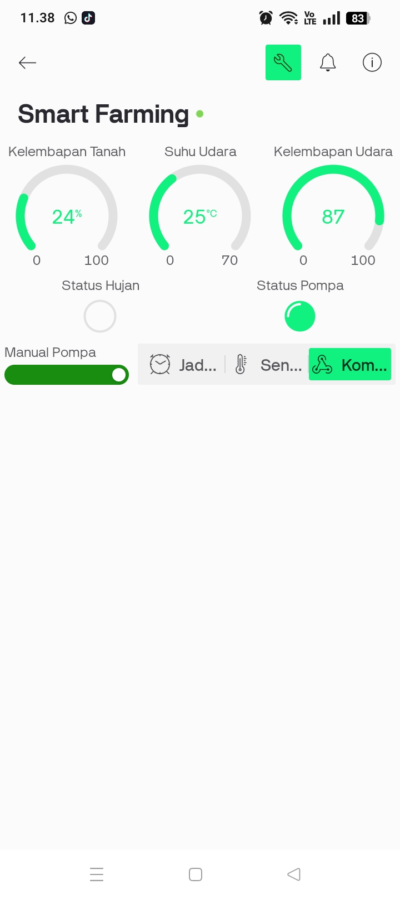

# Sistem Smart Farming Berbasis IoT

Sistem pemantauan dan penyiraman otomatis untuk lahan pertanian menggunakan mikrokontroler ESP32 yang terintegrasi dengan aplikasi **Blynk** untuk monitoring jarak jauh secara real-time.

## 📋 Deskripsi

Proyek ini dikembangkan untuk membantu petani memantau kondisi lahan (kelembapan tanah, suhu udara, kelembapan udara, dan curah hujan) serta mengendalikan pompa penyiraman secara otomatis maupun manual melalui smartphone.

## ✨ Fitur

- 🌱 Monitoring kelembapan tanah secara real-time
- 🌡️ Monitoring suhu dan kelembapan udara (sensor DHT22)
- 🌧️ Deteksi status hujan otomatis
- 💧 Kontrol pompa otomatis berdasarkan jadwal (pagi & sore) dan kondisi tanah
- 📱 Kontrol pompa manual melalui aplikasi Blynk
- ⏰ Sinkronisasi waktu otomatis via NTP dan RTC (DS1307/DS3231)
- 🔔 Notifikasi status sistem ke aplikasi Blynk
- ⚙️ Kalibrasi sensor kelembapan tanah

## 🛠️ Perangkat Keras (Hardware)

- ESP32
- Sensor DHT22 (suhu & kelembapan udara)
- Sensor kelembapan tanah (soil moisture)
- Sensor hujan (rain sensor)
- Modul RTC (real-time clock)
- ADS1115 (ADC eksternal)
- Relay module (kontrol pompa)
- Pompa air
- Panel surya (catu daya)

## 💻 Perangkat Lunak & Library

- Arduino IDE
- Blynk (BlynkSimpleEsp32.h)
- Adafruit DHT sensor library
- RTClib
- Adafruit ADS1X15
- HTTPClient
- Preferences (penyimpanan konfigurasi)

## 📁 Struktur File

```
sistem-smart-farming-berbasis-IoT/
├── pertanian_cerdas1.ino   # Kode utama program
├── Images/                 # Dokumentasi gambar implementasi
└── README.md
```

## 🚀 Cara Instalasi & Penggunaan

1. Clone repository ini:
   ```
   git clone https://github.com/Rhilism20/sistem-smart-farming-berbasis-IoT.git
   ```
2. Buka file `pertanian_cerdas1.ino` menggunakan Arduino IDE.
3. Install seluruh library yang dibutuhkan melalui Library Manager.
4. Sesuaikan konfigurasi berikut sesuai kebutuhan:
   - `ssid[]` dan `pass[]` — kredensial WiFi
   - `BLYNK_AUTH_TOKEN` — token autentikasi Blynk
   - Pin sensor dan relay
   - Jadwal penyiraman (pagi/sore)
5. Upload program ke board ESP32.
6. Buka aplikasi Blynk untuk memantau dan mengendalikan sistem.

## 📸 Dokumentasi Implementasi

### 1. Proses Perakitan Perangkat
Perakitan komponen utama sistem smart farming, setiap komponen dipasang dan dihubungkan sesuai fungsinya agar sistem dapat berjalan dengan baik.


<p align="center"><i>Gambar 1: Perakitan perangkat</i></p>

### 2. Proses Pemrograman Sistem
Pemrograman mikrokontroler menggunakan Arduino IDE untuk mengatur pembacaan sensor, pengendalian pompa, serta komunikasi sistem dengan aplikasi monitoring.


<p align="center"><i>Gambar 2: Pemrograman mikrokontroler</i></p>

### 3. Implementasi Alat pada Lahan
Alat diterapkan langsung pada lahan tanaman untuk melakukan pemantauan kondisi tanaman dan mendukung proses penyiraman otomatis.


<p align="center"><i>Gambar 3: Implementasi dan pengujian alat pada lahan</i></p>

### 4. Pemasangan Sensor Moisture ke Tanah
Sensor dipasang pada media tanam untuk membaca kondisi kelembapan tanah sebagai dasar penentuan proses penyiraman.


<p align="center"><i>Gambar 4: Pengujian sensor moisture</i></p>

### 5. Tampilan Monitoring Blynk
Dashboard aplikasi Blynk menampilkan data kelembapan tanah, suhu udara, kelembapan udara, status hujan, status pompa, dan tombol kontrol pompa manual.


<p align="center"><i>Gambar 5: Tampilan monitoring Blynk</i></p>

## 👤 Kontributor

- **Rhilism20**

## 📄 Lisensi

Proyek ini bebas digunakan untuk keperluan edukasi dan pengembangan lebih lanjut.
